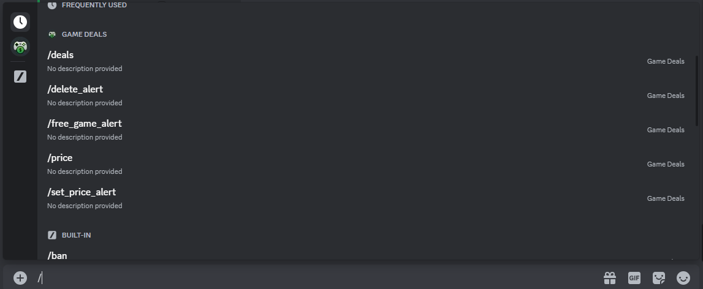

# Game Deals Bot

A discord bot for game deals, giveaways, and free game releases. 

## Table of Contents

- [Usage](#usage)
- [Built With](#built-with)
- [Support](#support)
- [Contributing](#contributing)

## Usage

[Invite the bot](https://discord.com/oauth2/authorize?client_id=1028073862597967932&permissions=2147485696&scope=bot) to your Discord server.

Application commands ([aka slash commands](https://support.discord.com/hc/en-us/articles/1500000368501-Slash-Commands-FAQ)) are the main entrypoint for all bot functions. Command options must be select from the given list.

### Commands

- `/price` - Get the current price overview of a game.
  - **Option**: `game_title` - Select a game title from the listed options.

- `/deals` - View the latest game deals sorted by various options.
  - **Option**: `sort_by` - Choose a sorting method from the listed options.

- `/set_price_alert` - Set various types of price alerts for a specific game.
  - **Option**: `alert_type` - Choose the type of price alert from the listed options.
  - **Option**: `game_title` - Select a game title from the listed options.

- `/free_game_alert` - Set an alert for when any game becomes free.

- `/delete_alert` - Delete a price alert from the server.
  - **Option**: `alert` - Select the alert to delete from the listed options.

### Buttons

Buttons can be used to give more information on any given game.

- **Alert** - Set a price target alert for the game.
- **More Info** - Get more detailed information about the game.
- **History** - View the 3 month price history of the game.

## Built With

This bot relies on several other libraries:

 - [Py-cord](https://github.com/Pycord-Development/pycord) - Discord API wrapper
 - [Supabase](https://github.com/supabase/supabase) - an open source Firebase alternative

## Deployment

You can deploy your own bot instance of the bot using Heroku. The cost is $7/month. More details can be found [in the deployment file](DEPLOYMENT.md).

## Support

Join the [support server](https://discord.gg/BtGjwBShYk)!
